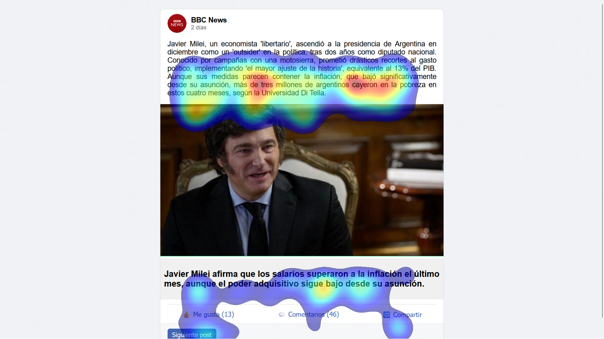
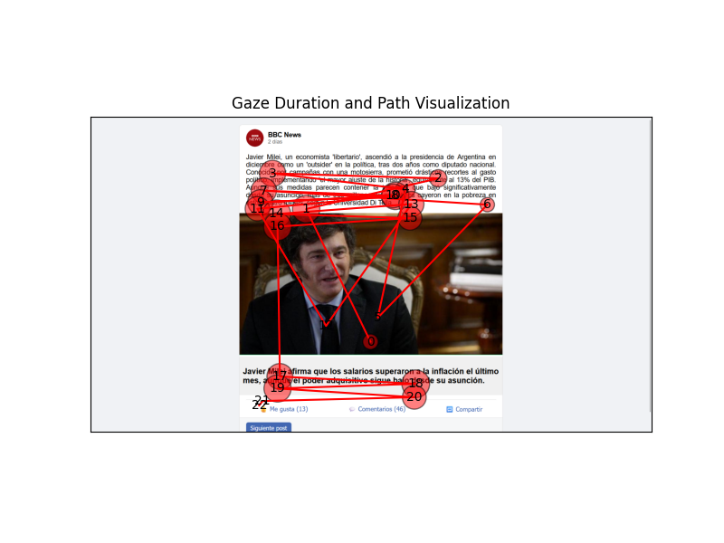

# FacebookEyeTracker

[](https://www.python.org/downloads/)
[](https://github.com/astral-sh/ruff)
[](https://creativecommons.org/licenses/by-nc/4.0/)
[](https://github.com/astral-sh/uv)

> Research pipeline for collecting, processing, and visualizing eye-tracking data on social media content using **Tobii Pro** hardware. Generates heatmaps and scanpath visualizations to analyze where users focus their attention.

---

## Visualization Examples

<table>
<tr>
<td align="center" width="50%">

**Heatmap** --- gaze intensity overlay



</td>
<td align="center" width="50%">

**Scanpath** --- eye movement trajectory



</td>
</tr>
</table>

---

## Tech Stack

| Category | Tools |
|---|---|
| **Language** | Python 3.10+ |
| **Eye Tracking** | Tobii Pro SDK (`tobii_research`) |
| **Visualization** | Matplotlib, NumPy |
| **Data Processing** | Pandas |
| **Screen Capture** | PyAutoGUI |
| **Linting & Formatting** | Ruff |
| **Type Checking** | ty |
| **Security** | Bandit, Ruff (flake8-bandit rules) |
| **Package Management** | uv |

---

## Architecture

```
Eye Tracker (Tobii Pro)
        |
        v
  generate.py -------> gaze.csv (raw binocular coordinates)
        |
        v
  gazeProcess.py ----> gaze_clean.csv (cleaned, interpolated, averaged)
        |
        v
  screenshot.py + Backend Server (post metadata)
        |                   |
        +-------+-----------+
                |
                v
          match.py -------> gaze_posts/ (per-post gaze CSVs)
                |            times/ (post timing JSON)
                v
      visualizations.py --> heatmaps/ + scanpath/
```

Each pipeline stage reads from the previous stage's output, enabling both full-pipeline execution and step-by-step debugging.

---

## Quick Start

### Prerequisites

- **Tobii Pro Eye Tracker** connected via USB
- **Tobii Pro Eye Tracker Manager** installed ([download](https://www.tobii.com/products/software/behavior-research-software/tobii-pro-eye-tracker-manager))
- **Windows** (required for Tobii SDK)
- **Backend server** on `localhost:3001` for post metadata

### Installation

```bash
# Clone
git clone https://github.com/sebastianbreguel/FacebookEyeTracker.git
cd FacebookEyeTracker

# Install dependencies with uv
uv sync

# Install dev tools
uv sync --group dev

# Setup pre-commit hooks
uv run pre-commit install
```

### Configuration

Edit `scripts/generate.py` to match your setup:

```python
user = "YourWindowsUsername"
SERIAL_NUMBER = "YOUR-DEVICE-SERIAL"
EYETRACKER_ADDRESS = "tobii-prp://YOUR-DEVICE-SERIAL"
```

### Run the Full Pipeline

```bash
uv run python pipeline.py --duration 60 --name participant_01 --width 1920 --height 1080
```

### Run Individual Steps

```bash
# 1. Collect eye-tracking data
uv run python scripts/generate.py 60 participant_01

# 2. Process raw gaze data
uv run python scripts/gazeProcess.py data/participant_01/gaze.csv data/participant_01/gaze_clean.csv 1920 1080

# 3. Match gaze data with posts
uv run python scripts/match.py participant_01

# 4. Generate visualizations
uv run python scripts/visualizations.py participant_01
```

### Batch Processing

```bash
uv run python tools/batch_process.py --participants alice bob charlie --steps process match visualize
```

---

## Project Structure

```
FacebookEyeTracker/
├── pipeline.py                        # Main pipeline orchestrator
├── pyproject.toml                     # Project config, dependencies & tool settings
│
├── scripts/                           # Core pipeline stages
│   ├── generate.py                    # Eye tracker calibration & data collection
│   ├── gazeProcess.py                 # Gaze data cleaning & interpolation
│   ├── match.py                       # Correlate gaze data with post timing
│   ├── screenshot.py                  # Screenshot capture during sessions
│   ├── visualizations.py              # Visualization orchestrator
│   ├── utils.py                       # Shared utilities
│   └── visualizations/
│       ├── gazeHeatplot.py            # Gaussian heatmap generation
│       └── scanpathPlot.py            # Scanpath with fixation detection
│
├── tools/                             # Utility scripts
│   ├── batch_process.py               # Multi-participant batch pipeline
│   └── cleanup.py                     # Data cleanup utility
│
├── single_post_test/                  # Simplified testing module
│
├── data_example/                      # Example data & outputs
│   └── nn/
│       ├── gaze.csv                   # Raw gaze sample
│       ├── gaze_clean.csv             # Processed gaze sample
│       ├── heatmaps/                  # Example heatmap output
│       └── scanpath/                  # Example scanpath output
│
└── data/                              # Runtime data (gitignored)
    └── <participant>/
        ├── gaze.csv
        ├── gaze_clean.csv
        ├── times/
        ├── screenshots/
        ├── gaze_posts/
        ├── heatmaps/
        └── scanpath/
```

---

## Data Format

**Raw gaze data** (`gaze.csv`) --- binocular normalized coordinates from Tobii:

```csv
time_seconds,current_time,left_x,left_y,right_x,right_y
0.000,2024-06-23T21:44:46.395Z,0.512,0.487,0.515,0.489
0.033,2024-06-23T21:44:46.428Z,0.518,0.492,0.520,0.494
```

**Processed gaze data** (`gaze_clean.csv`) --- single-point pixel coordinates:

```csv
time_seconds,current_time,x,y
0.000,2024-06-23T21:44:46.395Z,985,487
0.033,2024-06-23T21:44:46.428Z,1001,492
```

---

## Development

```bash
# Lint & format
uv run ruff check --fix .
uv run ruff format .

# Type check
uv run ty check

# Security scan
uv run bandit -r scripts/ tools/ pipeline.py -c pyproject.toml

# Run all pre-commit hooks
uv run pre-commit run --all-files
```

---

## License

This project is licensed under [CC BY-NC 4.0](https://creativecommons.org/licenses/by-nc/4.0/) --- free to share and adapt for non-commercial purposes with attribution.

## Citation

If you use this project in your research, please cite it:

```bibtex
@techreport{breguel2024facebookeyetracker,
  author      = {Breguel, Sebastian},
  title       = {FacebookEyeTracker: A Pipeline for Collecting, Processing,
                 and Visualizing Eye-Tracking Data on Social Media Content},
  institution = {Pontificia Universidad Cat\'{o}lica de Chile},
  year        = {2024},
  type        = {Technical Report},
  url         = {https://github.com/sebastianbreguel/FacebookEyeTracker},
  note        = {Developed as part of XR course research}
}
```

<!-- If published on arXiv, use this instead:
```bibtex
@article{breguel2024facebookeyetracker,
  author  = {Breguel, Sebastian},
  title   = {FacebookEyeTracker: A Pipeline for Collecting, Processing,
             and Visualizing Eye-Tracking Data on Social Media Content},
  journal = {arXiv preprint arXiv:XXXX.XXXXX},
  year    = {2024}
}
```
-->

Also available via GitHub's **"Cite this repository"** button (powered by [`CITATION.cff`](CITATION.cff)).

## Author

**Sebastian Breguel** --- [sebabreguel@uc.cl](mailto:sebabreguel@uc.cl)

Developed as part of XR course research at Pontificia Universidad Catolica de Chile.

## Acknowledgments

- [Tobii Pro](https://www.tobii.com/) for eye-tracking hardware and SDK
- [Astral](https://astral.sh/) for uv, ruff, and ty
